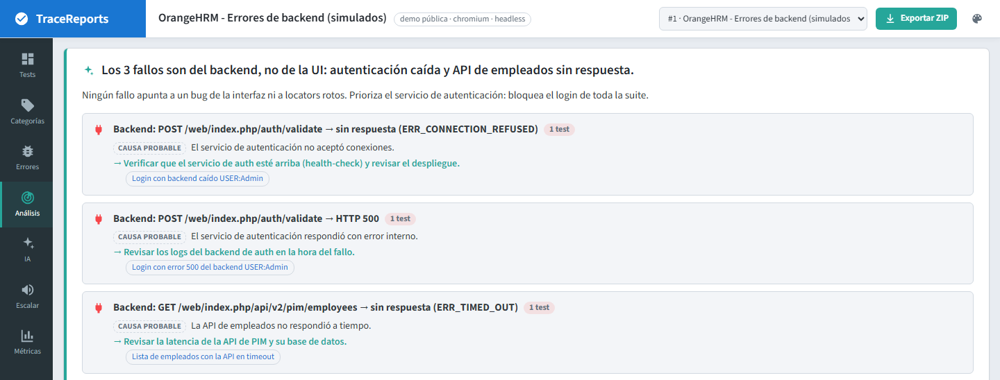
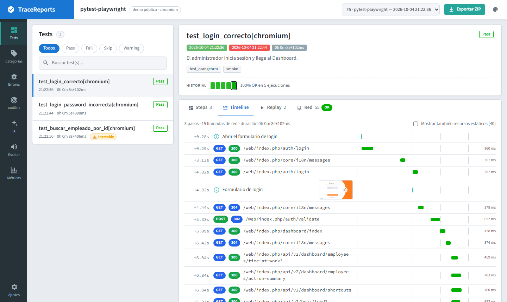
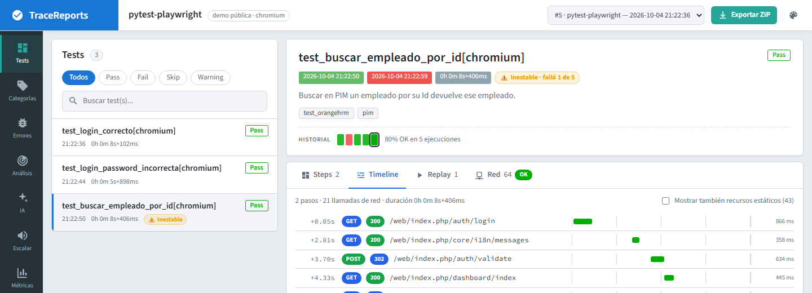

# TraceReports

🌐 [English](README.en.md) · **Español** · [Portada](README.es.md)

**El reporte de pruebas que te dice *por qué* falló un test, no solo *que* falló.**

TraceReports es un servidor de reportes de testing autohospedado. Reúne en un solo lugar lo que
hoy está repartido entre el reporte HTML, los logs del backend y la cabeza del QA:

- **Evidencia de UI**: cada paso con su captura de pantalla.
- **Tráfico HTTP visto por el navegador**: todas las llamadas de red que hizo la página durante el
  test (status, duración, headers y bodies), con *Copiar como cURL*. Es lo que el navegador observa
  del backend, **no** los logs ni las trazas internas del servicio: TraceReports no los captura.
- **Diagnóstico con IA**: clasifica cada fallo (locator roto, backend caído, bug de lógica,
  infraestructura) y agrupa la ejecución completa en incidentes por evidencia compartida: *"15 tests
  fallaron justo después de que POST /auth/login respondiera 500"*. La causa que sugiere la IA es una
  hipótesis y se muestra como tal, junto a la evidencia en que se basa.



## Qué incluye

| | |
|---|---|
| **Diagnóstico de la ejecución** | Agrupa los fallos por evidencia compartida (la misma llamada de backend fallida justo antes del fallo, o la misma firma de error) y resume en lenguaje claro qué pasó y qué hacer primero. Ningún fallo queda fuera del resumen. |
| **AI Failure Triage por test** | Categoría, resumen y sugerencia para cada test fallido. Con Gemini (capa gratuita), Claude, OpenAI, cualquier API compatible u **Ollama local**. |
| **Locators rotos** | Si un selector dejó de funcionar, propone reemplazos robustos (`get_by_role`, `data-testid`…) a partir del DOM al fallar, listos para copiar y marcados sobre la captura. |
| **Replay** | Reproduce el test paso a paso con sus capturas: play/pausa, 1x/2x y teclado. |
| **Pestaña Red** | Llamadas HTTP que hizo el navegador en cada test: OK / error, filtros, JSON resaltado, vista previa HTML, cURL. Las respuestas negativas esperadas (un 401 verificado a propósito) se marcan y no cuentan como error. |
| **Timeline** | Pasos, capturas y llamadas de red en una sola línea de tiempo, con cascada de duraciones. |
| **Historial y flaky** | Últimas ejecuciones de cada test (por su identidad estable, en el mismo proyecto, ambiente y rama). Distingue un test **inestable** (alterna o pasa tras reintento) de una **falla persistente**, muestra la tasa de fallo y avisa cuando hay pocos datos. |
| **Latencia vs. historial** | Marca los tests cuya red se volvió más lenta (p95) que en sus ejecuciones anteriores, con el detalle por endpoint. |
| **Mocks del backend** | Desde una llamada fallida genera el stub en Playwright, Cypress o WireMock, con datos sensibles enmascarados. |
| **En vivo** | Los pasos aparecen mientras el test corre (Server-Sent Events), con reconexión automática. |
| **Comparación** | Fallos nuevos, arreglados, que siguen fallando y tests más lentos respecto de la ejecución anterior del mismo contexto, o de la que elijas. |
| **Endpoints** | Ranking de los endpoints del backend con errores y más lentos (p95) durante la ejecución. |
| **Análisis con IA** | Menú *IA*: causas de los fallos de la ejecución, si se repiten en ejecuciones anteriores y qué hacer; permite volver a analizar (por ejemplo, tras un límite de cuota). |
| **Escalar** | Convierte un fallo en un resumen para **Negocio**, **QA** o **Desarrollo**, con la captura, las llamadas que fallaron y el diagnóstico. Se copia como texto, Slack, Markdown, correo con formato o **imagen**, o se envía directo a Teams/Slack. |
| **Métricas** | Calidad en el tiempo entre ejecuciones, filtrable por suite, ambiente, tag y rango de fechas: tendencia, tests que más fallan y cuánto tiempo cuestan, flaky, más lentos, causas y estabilidad por categoría. Clic en un día o en un test para ver el detalle. |
| **Teams / Slack** | Al terminar, el resumen llega al canal con un botón *Ver reporte*. Opcional: un **resumen semanal** (`TRACEREPORTS_WEEKLY_SUMMARY`) con la tendencia frente a la semana anterior. |
| **Córrelo en local** | El detalle de un test trae el comando para repetirlo en tu máquina en el commit exacto de la ejecución: `pytest '<nodeid>'`, `npx playwright test … -g …`, Maven/Gradle para JUnit o `go test -run`. |
| **Comparar con la última vez que pasó** | En una llamada fallida, la misma llamada (mismo método, host y path, con los ids normalizados) de la ejecución más reciente en que el test pasó: status, duración, headers y bodies de la respuesta, campo por campo cuando son JSON. |
| **Consola del navegador** | Pestaña *Consola* con `console.error`, advertencias y errores de JavaScript no manejados, enmascarados, que también llegan al diagnóstico con IA. Se captura sola con pytest-playwright y los fixtures de Playwright. |
| **Trace y video de Playwright** | El video se reproduce en el detalle del test; el trace se descarga o se abre en **Trace Viewer**. Los sube el reporter de Playwright Test, o se adjuntan desde Python, Java y Go. |
| **Correlación con los logs del backend** | Los ids de traza y de request que vienen en los headers (W3C `traceparent`, B3, Jaeger, X-Ray, Datadog, `X-Request-Id`…) se convierten en links **Ver logs** / **Ver traza** armados con tus propias plantillas (Datadog, Kibana, Jaeger…). TraceReports enlaza a tus logs; no los recolecta. |
| **Cuarentena** | Un flaky conocido se pone en cuarentena con motivo, dueño y vencimiento: sus fallos se siguen viendo, pero no ponen la ejecución en rojo hasta la fecha. |
| **Dueños** | Reglas al estilo CODEOWNERS por identidad del test, tag o suite; el dueño llega a Escalar y a los tickets. |
| **Clasificación de fallos** | *Bug de producto*, *test roto*, *ambiente*, *datos de prueba*, *flaky* u *otro*, con un comentario; la próxima vez que el test falla ofrece el mismo veredicto en un clic. |
| **Tickets** | Desde Escalar abre el issue en **GitHub**, **Jira** o **Azure DevOps** con el resumen, el error, las llamadas que fallaron y la captura. Si el test ya tiene uno, lo muestra en vez de duplicarlo. |
| **Release** | La vista *Release* responde "¿podemos salir?": **Listo para salir**, **Se puede salir, con riesgos** o **No salir todavía**, con los criterios y el estado de cada área. Se configura con `TRACEREPORTS_RELEASE_GATE`. |
| **Comentario en el pull request** | `tracereports pr-comment` publica el resumen de la ejecución en el PR de GitHub o el MR de GitLab (fallos, qué cambió, flaky, incidentes, link al reporte) y actualiza el mismo comentario en cada push. |
| **Sin servidor** | Si el servidor está caído o rechaza el token, los clientes graban la evidencia en una carpeta. `tracereports report <carpeta>` arma el reporte HTML (sin servidor ni internet) y `tracereports push <carpeta>` lo sube después. |
| **JUnit XML y Allure** | Importa los resultados de cualquier framework (`POST /api/v1/import/junit`, `/import/allure`), o los convierte en un reporte sin servidor con `tracereports report`. |
| **Compartir** | Exporta la ejecución a un ZIP que se abre sin servidor ni internet (gráficos y fuentes incluidos), ideal para adjuntar a un correo. |
| **Datos sensibles** | El servidor enmascara tokens, contraseñas, cookies y credenciales (escritos como `clave=valor`, JSON, headers, Bearer/JWT o dentro de URLs) en la evidencia y en nombres e identidades de tests antes de guardar nada, venga del cliente que venga; lo guardado ya no llega a la IA, al ZIP ni a Teams/Slack. No cubre texto libre sin clave ni lo que se ve en las capturas. Retención opcional por días. |
| **Entrega confiable** | El cliente Python envía la evidencia en segundo plano con reintentos e idempotencia (sin duplicados, aunque un spool se reenvíe días después), consolida pytest-xdist en un solo reporte y avisa si algo no llegó. |
| **Ajustes** | Idioma (español / inglés), tema y proveedor de IA con *Probar conexión*, sin reiniciar el servidor. **Uso de la IA**: llamadas, tokens informados por el proveedor, respuesta media y errores por motivo (hoy, 7 y 30 días), más el estado del proveedor. Escalar muestra cuánto tardó la respuesta de la IA y por qué reintentó. |
| **6 temas** | Trace, Trace Dark, Midnight, Paper, Pixel y Terminal. |

Un solo binario de Go (UI incluida, SQLite embebido, sin CGO). Clientes para **Python** (plugin de
pytest), **JavaScript/TypeScript** (reporter de Playwright Test, Selenium), **Java** (JUnit 5,
Selenium, Playwright) y **Go**, y una API REST para cualquier otro lenguaje.

| Timeline: pasos + red | Historial y flaky |
|---|---|
|  |  |

## Inicio rápido

**1. Levanta el servidor** (elige uno):

```bash
docker compose up -d          # con Docker
go run ./cmd                  # con Go 1.26+
```

Abre <http://localhost:8080>.

**2. Reporta tus tests.** Con pytest no cambias código:

```bash
pip install pytest pytest-playwright tracereports
pytest --tracereports
```

Con [JavaScript/TypeScript](docs/es/javascript.md) (Playwright Test o Selenium), [Java](docs/es/java.md)
(JUnit 5 con Selenium o Playwright), [Go](docs/es/go.md) o cualquier otro lenguaje con la
[API REST](docs/es/api.md).

**3. (Opcional) Activa la IA y las notificaciones** con variables de entorno:
`GEMINI_API_KEY` (o Claude, OpenAI, Ollama…), `TEAMS_WEBHOOK_URL`, `SLACK_WEBHOOK_URL`. La IA también
se puede configurar en **Ajustes**, sin reiniciar. Ver [configuración](docs/es/configuration.md).

**4. (Recomendado si el servidor no es solo tuyo) Protégelo con un token.** Genera uno con Python
(funciona igual en Windows, macOS y Linux):

```bash
python -c "import secrets; print(secrets.token_hex(24))"
```

Ponlo en el `.env` del servidor (`TRACEREPORTS_TOKEN=...`) y reinícialo. Luego define **el mismo valor**
donde corren los tests: los clientes lo leen solos de la variable de entorno.

```powershell
$env:TRACEREPORTS_TOKEN = "el-token-generado"      # PowerShell; en macOS/Linux: export TRACEREPORTS_TOKEN=...
pytest --tracereports
```

En **Ajustes → Conectar tus tests** tienes los comandos para cada terminal y CI, y un botón para
verificar que el servidor acepta el token. Más detalle en [configuración](docs/es/configuration.md#seguridad).

## Ejemplos

Todos usan la demo pública de [OrangeHRM](https://opensource-demo.orangehrmlive.com):

| Ejemplo | Para quién | Cómo correrlo |
|---|---|---|
| [`examples/pytest-playwright`](examples/pytest-playwright/README.es.md) | pytest: lo mínimo, solo el plugin | `pytest examples/pytest-playwright --tracereports` |
| [`examples/playwright-js`](examples/playwright-js/README.es.md) | Playwright Test (JS): reporter + fixtures | `cd examples/playwright-js && npm install && npm test` |
| [`examples/selenium-js`](examples/selenium-js/README.es.md) | Selenium WebDriver con node:test | `cd examples/selenium-js && npm install && npm test` |
| [`examples/selenium-java`](examples/selenium-java/README.es.md) | Selenium con JUnit 5 | `cd examples/selenium-java && ./gradlew test` |
| [`examples/playwright-java`](examples/playwright-java/README.es.md) | Playwright para Java con JUnit 5 | `cd examples/playwright-java && ./gradlew test` |
| [`examples/playwright-go`](examples/playwright-go/README.es.md) | Go con playwright-go | `cd examples/playwright-go && go test -v ./...` |
| [`examples/orangehrm`](examples/orangehrm/README.es.md) | Framework Page Object con unittest: captura de red, tests negativos y fallas simuladas del backend | `python examples/orangehrm/tests/test_orangehrm_pim.py` |

## Documentación

- [Instalación](docs/es/installation.md): binario, Docker, primer uso.
- [Docker](docs/es/docker.md): uso diario, datos, backup y despliegue en un servidor con HTTPS.
- [Configuración](docs/es/configuration.md): variables de entorno, seguridad, IA, idioma, Teams/Slack.
- [Cliente Python y plugin de pytest](docs/es/python.md)
- [Cliente JavaScript/TypeScript: Playwright Test y Selenium](docs/es/javascript.md)
- [Cliente Java: JUnit 5, Selenium y Playwright](docs/es/java.md)
- [Cliente Go y playwright-go](docs/es/go.md)
- [API REST](docs/es/api.md)
- [Integración continua](docs/es/ci.md): GitHub Actions, GitLab, Jenkins, importación de JUnit XML y el comentario en el pull request.
- [Sin servidor](docs/es/offline.md): grabar, armar el reporte y subirlo después.
- [Tokens de UI y componentes](docs/es/ui-tokens.md): para crear temas, componentes o traducciones.

## Estructura

```
cmd/                 servidor y CLI (report, push, pr-comment, secrets)
internal/api         API REST, autenticación, ajustes, exportación ZIP
internal/db          SQLite: ejecuciones, tests, pasos, red, historial, métricas, ajustes, uso de la IA
internal/ai          diagnóstico y escalamiento con IA (Gemini, Claude, OpenAI, compatibles, Ollama)
internal/redact      enmascarado de secretos en la evidencia
internal/offline     grabaciones hechas sin servidor: report y push
internal/junit       importación de JUnit XML
internal/allure      importación de resultados de Allure
internal/tracker     tickets en GitHub, Jira y Azure DevOps
internal/prcomment   comentario en el pull request / merge request
internal/correlate   ids de traza y de request, links a los logs del backend
internal/release     decisión de salida (vista Release)
internal/owners      dueños de los tests (reglas al estilo CODEOWNERS)
internal/repro       comando para repetir un test en local
internal/secret      cifrado de las credenciales guardadas desde Ajustes
internal/locator     recomendación de selectores cuando se rompe un locator
internal/live        eventos en vivo (Server-Sent Events)
internal/notify      notificaciones a Teams y Slack, resumen semanal
web/                 interfaz (HTML/CSS/JS sin build, embebida en el binario; español e inglés)
client/python        cliente Python + plugin de pytest
client/js            cliente JavaScript/TypeScript + reporter de Playwright Test
client/java          cliente Java + extensión de JUnit 5
client/go            cliente Go
examples/            ejemplos ejecutables
docs/es, docs/en     documentación en español e inglés
```

## Licencia

[Apache-2.0](LICENSE).
