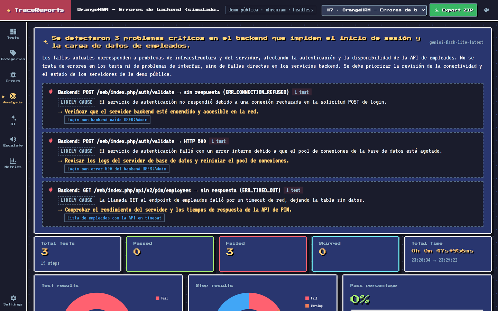
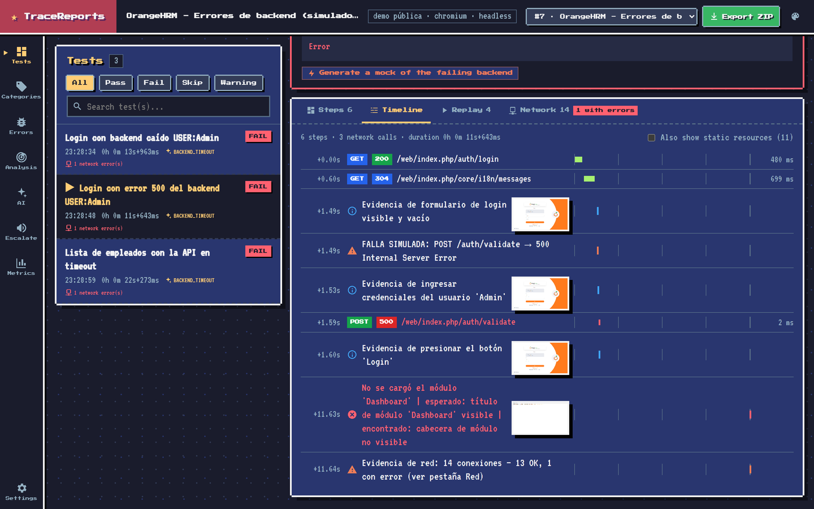
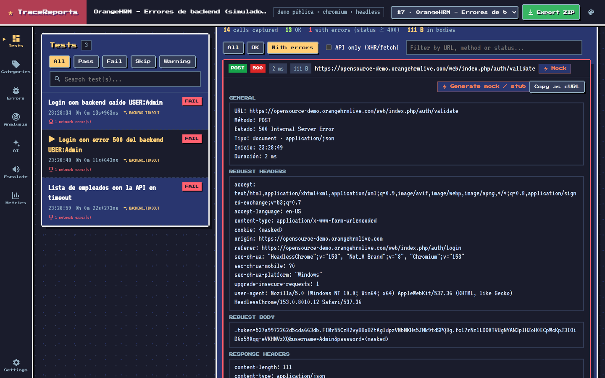
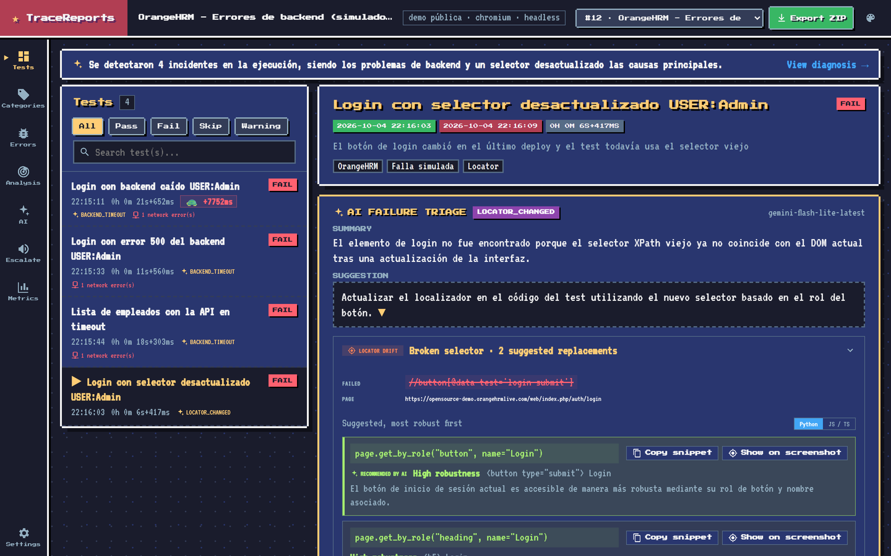
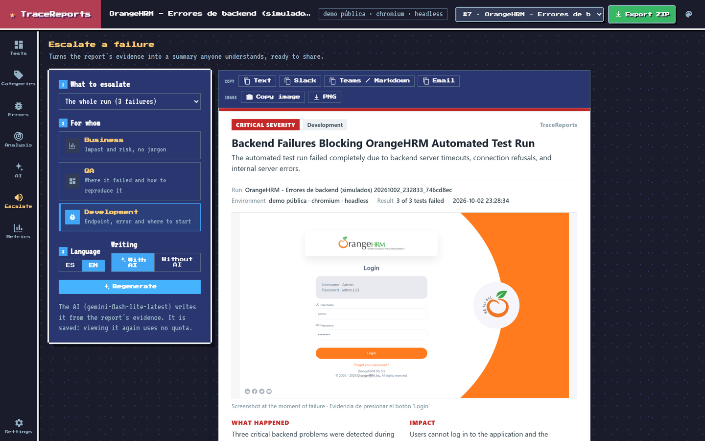
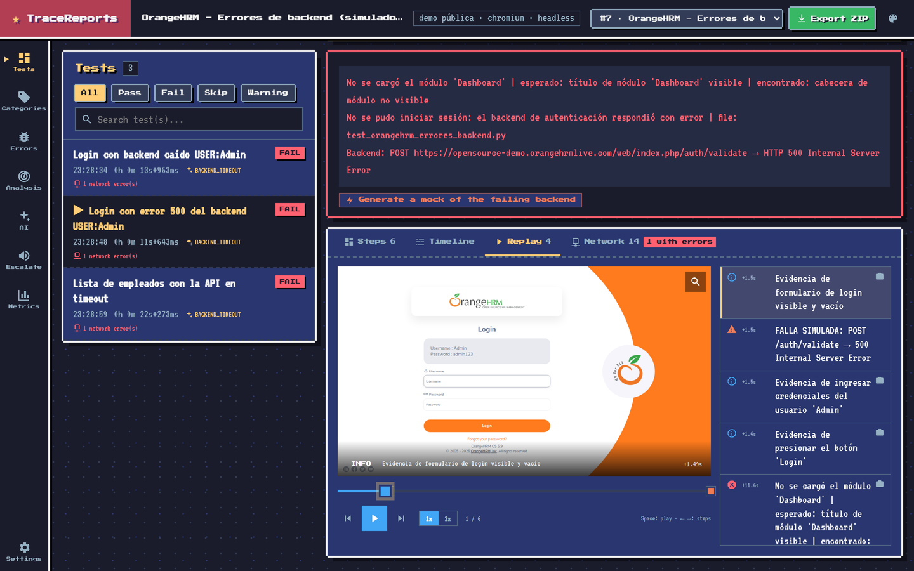
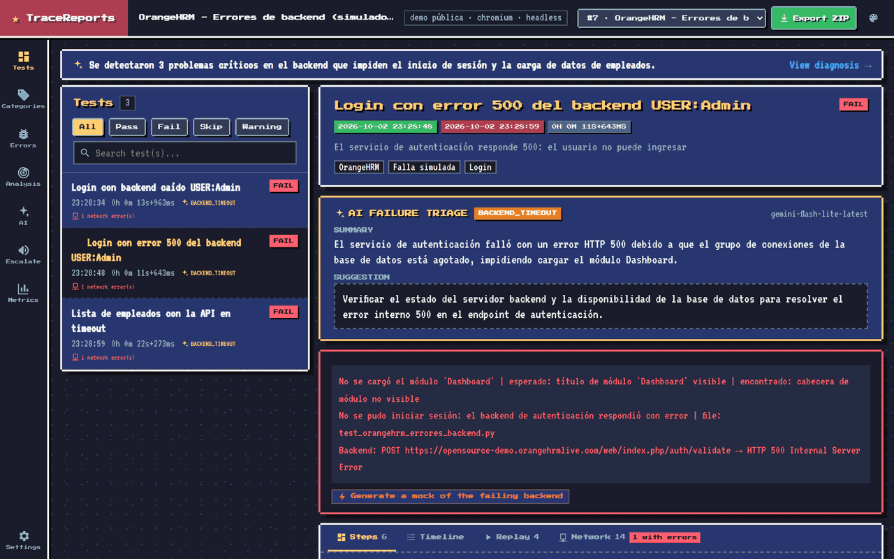
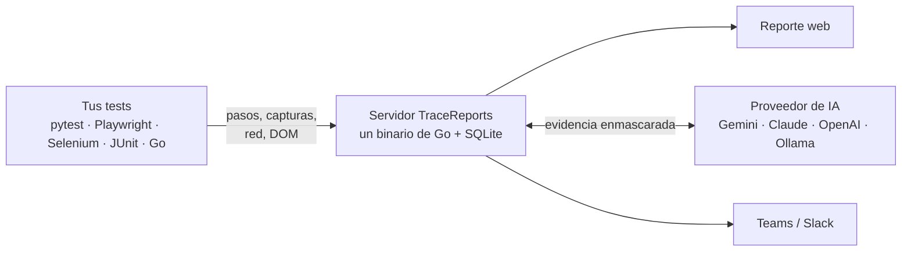

<a href="https://github.com/josemiguellopez/tracereports"></a>

<p align="center">
  <a href="https://github.com/josemiguellopez/tracereports/stargazers"></a>
  <a href="./LICENSE"></a>
  
  
  
</p>

<p align="center">
  <b>pytest</b> · <b>Playwright</b> · <b>Selenium</b> · <b>JUnit 5</b> · <b>Go</b> · cualquier lenguaje vía REST
  <br />
  🌐 <a href="README.md">English</a> · <b>Español</b>
</p>

<p align="center">
  <a href="#inicio-rápido"><b>Inicio rápido</b></a> ·
  <a href="#qué-incluye"><b>Funciones</b></a> ·
  <a href="#elige-tu-estilo"><b>Temas</b></a> ·
  <a href="#cómo-funciona"><b>Cómo funciona</b></a> ·
  <a href="#documentación"><b>Docs</b></a>
</p>

# TraceReports

**El reporte de pruebas que te dice *por qué* falló un test, no solo *que* falló.**

TraceReports es un servidor de reportes de testing autohospedado. Cada paso con su captura, cada
llamada HTTP que hizo el navegador y un diagnóstico con IA que convierte una pared roja en un
puñado de incidentes.

```bash
docker compose up -d                       # servidor + UI en http://localhost:8080
pip install pytest pytest-playwright ./client/python
pytest --tracereports                      # listo, sin cambiar tu código
```

<p align="center">
  
  <br />
  <sub>Una ejecución real de la <a href="examples/orangehrm">suite de ejemplo de OrangeHRM</a> con fallos de backend simulados, en el tema Pixel.</sub>
</p>

## El problema

Son las 9 de la mañana y la ejecución nocturna tiene 15 tests en rojo. Toca abrir los logs del
backend, reproducir en local y preguntar en Slack si alguien hizo un deploy.

TraceReports junta la evidencia mientras el test corre, así que el reporte ya sabe qué pasó:

<table>
  <tr>
    <th width="50%">😩 Un reporte típico</th>
    <th width="50%">🕵️ TraceReports</th>
  </tr>
  <tr>
    <td valign="top">
<pre>
FAILED test_login_admin
  TimeoutError: Timeout 30000ms exceeded
  waiting for "Dashboard" to be visible
FAILED test_pim_search
  TimeoutError: Timeout 30000ms exceeded
FAILED test_employee_list
  TimeoutError: Timeout 30000ms exceeded
... 12 más
</pre>
    </td>
    <td valign="top">
      <b>🔴 1 incidente · 15 tests</b>
      <br /><br />
      Todos los fallos ocurrieron justo después de que <code>POST /auth/login</code> respondiera <b>500</b>.
      <br /><br />
      <b>Causa probable:</b> el servicio de autenticación se quedó sin conexiones a la base de datos.
      <br />
      <b>Revisa primero:</b> el servicio de autenticación y su pool de conexiones.
      <br /><br />
      📸 captura · 🌐 llamada fallida con su body · ⏱️ timeline
    </td>
  </tr>
</table>

La causa que sugiere la IA siempre se presenta como hipótesis, junto a la evidencia en que se basa.

<p align="center"></p>

## Qué incluye

<table>
  <tr>
    <td width="50%" valign="top">
      <h3>🧠 Diagnóstico de la ejecución</h3>
      Agrupa en incidentes los fallos que comparten evidencia (la misma llamada de backend fallida,
      la misma firma de error), con la causa probable y qué revisar primero.
      <br /><br />
      
    </td>
    <td width="50%" valign="top">
      <h3>⏱️ Timeline</h3>
      Pasos, capturas y llamadas de red en una sola línea de tiempo. Ves exactamente qué esperaba el
      test cuando el backend respondió 500.
      <br /><br />
      
    </td>
  </tr>
  <tr>
    <td width="50%" valign="top">
      <h3>🌐 La red que vio el navegador</h3>
      Status, tiempos, headers y bodies, con <i>Copiar como cURL</i> y un stub para Playwright,
      Cypress o WireMock generado desde la llamada fallida. Contraseñas y cookies llegan ya
      enmascaradas.
      <br /><br />
      
    </td>
    <td width="50%" valign="top">
      <h3>🎯 Locators rotos</h3>
      Cuando un selector deja de funcionar, lee el DOM del momento del fallo y propone reemplazos
      robustos, listos para copiar y marcados sobre la captura.
      <br /><br />
      
    </td>
  </tr>
  <tr>
    <td width="50%" valign="top">
      <h3>📣 Escala en un clic</h3>
      Un resumen para Negocio, QA o Desarrollo con la captura, las llamadas fallidas y el
      diagnóstico. Cópialo como texto, Markdown, correo o imagen, o envíalo a Teams o Slack.
      <br /><br />
      
    </td>
    <td width="50%" valign="top">
      <h3>▶️ Replay</h3>
      Reproduce el test paso a paso con sus capturas, como un video. Play, pausa, 1x/2x y atajos de
      teclado.
      <br /><br />
      
    </td>
  </tr>
</table>

Y además:

- **Flaky o roto.** Historial por test que distingue un test flaky de un fallo persistente.
- **Regresiones de latencia.** Marca los tests cuya red se volvió más lenta (p95) que en ejecuciones anteriores.
- **Comparación de ejecuciones.** Fallos nuevos, tests arreglados y tests más lentos frente a la ejecución anterior.
- **En vivo.** Los pasos aparecen mientras los tests siguen corriendo.
- **Métricas.** Tasa de éxito, los tests que más tiempo hacen perder, los flaky y las causas de fallo en el tiempo.
- **Comparte sin servidor.** Exporta una ejecución como ZIP que se abre sin servidor ni internet.

La [guía completa](GUIA-COMPLETA.md) cubre todas las opciones.

<p align="center"></p>

## Elige tu estilo

Seis temas que se cambian desde la interfaz: Trace, Trace Dark, Midnight, Paper, Terminal y, por
supuesto, Pixel.

<p align="center">
  
</p>

## Cómo funciona



Los clientes envían la evidencia en segundo plano, así que un servidor lento o caído nunca rompe
tus tests. El servidor enmascara los secretos antes de guardar nada, y la IA y los webhooks son
opcionales.

<p align="center"></p>

## Inicio rápido

**1. Levanta el servidor.**

```bash
docker compose up -d     # o: go run ./cmd   (Go 1.26+)
```

**2. Reporta tus tests** con uno de los clientes:

| Cliente | Qué hace |
| --- | --- |
| [`client/python`](client/python) | Plugin de pytest: `pytest --tracereports`. Envío en segundo plano con reintentos y soporte para pytest-xdist. |
| [`client/js`](client/js) | Reporter y fixtures para Playwright Test, más helpers para Selenium WebDriver. JavaScript y TypeScript. |
| [`client/java`](client/java) | Extensión de JUnit 5 para Selenium y Playwright para Java. |
| [`client/go`](client/go) | Cliente de Go, con un ejemplo de playwright-go. |
| [API REST](docs/es/api.md) | Cualquier otro lenguaje o framework. |

**3. (Opcional) Activa la IA.** Define `GEMINI_API_KEY` (capa gratuita) o elige Claude, OpenAI,
cualquier API compatible u Ollama local en **Configuración**, sin reiniciar.

**4. (Recomendado si el servidor es compartido) Protégelo** con `TRACEREPORTS_TOKEN`. Mira
[configuración](docs/es/configuration.md#seguridad).

En [`examples/`](examples) hay ejemplos ejecutables para cada cliente, todos contra la demo
pública de OrangeHRM.

🚧 *TraceReports está antes de la 1.0: los clientes, la API y la configuración todavía pueden cambiar entre versiones menores.*

## Documentación

- [Guía completa](GUIA-COMPLETA.md)
- [Instalación](docs/es/installation.md) · [Docker](docs/es/docker.md) · [Configuración](docs/es/configuration.md)
- [Python](docs/es/python.md) · [JavaScript](docs/es/javascript.md) · [Java](docs/es/java.md) · [Go](docs/es/go.md) · [API REST](docs/es/api.md)
- [Integración continua](docs/es/ci.md) · [Tokens de UI y temas](docs/es/ui-tokens.md)

## Privacidad

TraceReports corre en tu propia máquina o servidor y no envía telemetría. Tokens, contraseñas,
cookies y credenciales se enmascaran antes de guardar nada, venga del cliente que venga. La
evidencia solo sale de tu servidor si activas un proveedor de IA en la nube (usa Ollama para
mantenerla en casa) o un webhook de Teams/Slack. Las capturas se guardan tal cual, así que evita
mostrar secretos en pantalla.

<p align="center"></p>

## Apoya el proyecto

Si TraceReports te ahorró una mañana revisando logs, **dale una ⭐**. Es la forma más fácil de que
otros QA lo encuentren.

Y si quieres invitarme un café mientras sigo construyéndolo:

<a href="https://paypal.me/lopezjosemiguel"></a>

## Licencia

[Apache-2.0](LICENSE). El gopher de Go en pixel art del banner está adaptado del gopher original de
Renée French, con licencia [CC BY 4.0](https://creativecommons.org/licenses/by/4.0/).

<p align="center">
  <a href="https://star-history.com/#josemiguellopez/tracereports&Date">
    
  </a>
</p>
