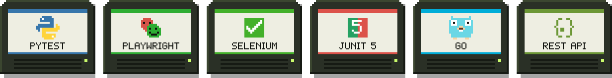
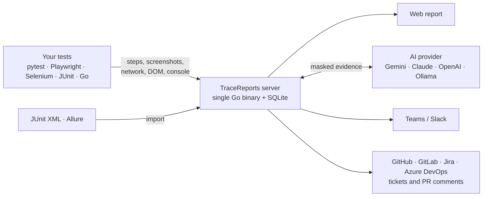

<a href="https://github.com/josemiguellopez/tracereports"></a>

<p align="center">
  <a href="https://tracereports.netlify.app/#start"></a>
  <a href="https://github.com/josemiguellopez/tracereports/stargazers"></a>
  <a href="https://github.com/josemiguellopez/tracereports/actions/workflows/ci.yml"></a>
  <a href="./LICENSE"></a>
  
  
  <a href="https://pypi.org/project/tracereports/"></a>
  <a href="https://www.npmjs.com/package/tracereports"></a>
  
</p>

<p align="center">
  
  <br /><br />
  🌐 <b>English</b> · <a href="README.es.md">Español</a>
</p>

<p align="center">
  <a href="#quick-start"><b>Quick start</b></a> ·
  <a href="#whats-inside"><b>Features</b></a> ·
  <a href="#pick-your-look"><b>Themes</b></a> ·
  <a href="#how-it-works"><b>How it works</b></a> ·
  <a href="#documentation"><b>Docs</b></a>
</p>

# TraceReports

**The test report that tells you *why* a test failed, not just *that* it failed.**

TraceReports is a self-hosted test report server. Every step with its screenshot, every HTTP call
the browser made, and an AI diagnosis that turns a wall of red into a handful of incidents.

```bash
docker run -d -p 8080:8080 -v tracereports-data:/data ghcr.io/josemiguellopez/tracereports   # server + UI on http://localhost:8080
pip install pytest pytest-playwright tracereports
pytest --tracereports                      # that's it, no code changes
```

👉 **[Try the live demo](https://tracereports.netlify.app/demo/)**: a real report you can click around, no install needed.

Not using pytest? TraceReports works the same with **Playwright Test**, **Selenium**, **JUnit 5**, **Go** or any
language over the **REST API**: [pick your language](#2-run-an-example-in-your-language).

<p align="center">
  
  <br />
  <sub>A real run of the <a href="examples/orangehrm">OrangeHRM example suite</a> with simulated backend failures, in the Pixel theme.</sub>
</p>

## The problem

It's 9 a.m. and the nightly run has 15 red tests. Time to open the backend logs, rerun locally and
ask on Slack whether someone deployed something.

TraceReports collects the evidence while the test runs, so the report already knows what happened:

<table>
  <tr>
    <th width="50%">😩 A typical report</th>
    <th width="50%">🕵️ TraceReports</th>
  </tr>
  <tr>
    <td valign="top">
<pre>
FAILED test_login_admin
  TimeoutError: Timeout 30000ms exceeded
  waiting for "Dashboard" to be visible
FAILED test_pim_search
  TimeoutError: Timeout 30000ms exceeded
FAILED test_employee_list
  TimeoutError: Timeout 30000ms exceeded
... 12 more
</pre>
    </td>
    <td valign="top">
      <b>🔴 1 incident · 15 tests</b>
      <br /><br />
      Every failure happened right after <code>POST /auth/login</code> returned <b>500</b>.
      <br /><br />
      <b>Likely cause:</b> the auth service ran out of database connections.
      <br />
      <b>Check first:</b> the auth service and its connection pool.
      <br /><br />
      📸 screenshot · 🌐 failed call with its body · ⏱️ timeline
    </td>
  </tr>
</table>

The AI cause is always shown as a hypothesis, next to the evidence it relies on.

<p align="center"></p>

## What's inside

<table>
  <tr>
    <td width="50%" valign="top">
      <h3>🧠 Run diagnosis</h3>
      Groups failures that share evidence (the same failed backend call, the same error signature)
      into incidents, with the likely cause and what to check first.
      <br /><br />
      
    </td>
    <td width="50%" valign="top">
      <h3>⏱️ Timeline</h3>
      Steps, screenshots and network calls on one timeline. See exactly what the test was waiting
      for when the backend answered 500.
      <br /><br />
      
    </td>
  </tr>
  <tr>
    <td width="50%" valign="top">
      <h3>🌐 The network the browser saw</h3>
      Status, timings, headers and bodies, with <i>Copy as cURL</i> and a Playwright, Cypress or
      WireMock stub generated from the failed call. Passwords and cookies arrive already masked.
      <br /><br />
      
    </td>
    <td width="50%" valign="top">
      <h3>🎯 Broken locators</h3>
      When a selector stops matching, it reads the DOM at the moment of failure and suggests
      robust replacements, ready to copy and highlighted on the screenshot.
      <br /><br />
      
    </td>
  </tr>
  <tr>
    <td width="50%" valign="top">
      <h3>📣 Escalate in one click</h3>
      A summary for Business, QA or Development with the screenshot, the failed calls and the
      diagnosis. Copy it as text, Markdown, email or image, or send it to Teams or Slack.
      <br /><br />
      
    </td>
    <td width="50%" valign="top">
      <h3>▶️ Replay</h3>
      Plays the test back step by step with its screenshots, like a video. Play, pause, 1x/2x and
      keyboard shortcuts.
      <br /><br />
      
    </td>
  </tr>
</table>

And also:

- **Flaky vs. broken.** History per test that tells a flaky test from a persistent failure.
- **Latency regressions.** Flags tests whose network got slower (p95) than in previous runs.
- **Run comparison.** New failures, fixed tests and slower tests compared with the previous run.
- **Live.** Steps show up while the tests are still running.
- **Metrics.** Pass rate, the tests that waste the most time, flaky tests and failure causes over
  time, plus a weekly summary in Teams or Slack.
- **Share offline.** Export a run as a ZIP that opens without a server or internet.

**For whoever fixes it**

- **Run it locally.** The exact command to rerun the failed test at the run's commit (pytest,
  Playwright, Maven/Gradle or `go test`).
- **Compare with the last pass.** A failed call next to the same call the last time the test
  passed: status, duration, headers and bodies, field by field.
- **Browser console.** `console.error`, warnings and unhandled JavaScript errors, also fed to the AI.
- **Playwright trace and video.** Watch the video in the report and open the trace in Trace Viewer.
- **Backend logs.** Trace and request ids found in the headers become *Open logs* and *Open trace*
  links (Datadog, Kibana, Jaeger…).

**For the team**

- **Release view.** *Ready to ship*, *Can ship, with risks* or *Do not ship yet*, with the criteria
  behind the decision and a configurable gate.
- **Tickets.** Open the GitHub, Jira or Azure DevOps issue straight from Escalate, without duplicates.
- **Pull request comments.** The run summary on the GitHub PR or GitLab MR, updated on every push.
- **Quarantine, owners and verdicts.** Quarantine a known flaky test until a date, assign owners
  like a CODEOWNERS file and classify failures so nobody investigates the same one twice.

**Anywhere**

- **No server, no lost evidence.** If the server is down or rejects the token, the clients record
  locally: `tracereports report` builds the HTML report and `tracereports push` uploads it later.
- **JUnit XML and Allure.** Import the results of any framework, or turn them into a report without
  a server.
- **AI you can measure.** Settings shows the calls, tokens, response times and the provider's
  status; Escalate tells how long the AI answer took and why it retried.

The [full feature tour](README.en.md) covers every option.

<p align="center"></p>

## Pick your look

Six themes, switchable from the UI: Trace, Trace Dark, Midnight, Paper, Terminal and, of course,
Pixel.

<p align="center">
  
</p>

## How it works



Clients send evidence in the background, so a slow or offline server never breaks your tests; if
it cannot be reached, they record the evidence to upload it later. The server masks secrets before
storing anything, and the AI, webhooks and trackers are optional.

<p align="center"></p>

## Quick start

### 1. Start the server

**With Docker** (recommended, nothing to clone):

```bash
docker run -d --name tracereports -p 8080:8080 -v tracereports-data:/data ghcr.io/josemiguellopez/tracereports
```

**Without Docker:** download the binary for your OS from the [latest release](https://github.com/josemiguellopez/tracereports/releases/latest) (Linux, macOS and
Windows, amd64 and arm64), unzip it and run `./tracereports` (`tracereports.exe` on Windows).

**From source:** `git clone https://github.com/josemiguellopez/tracereports.git && cd tracereports`, then `docker compose up -d` or `go run ./cmd` (Go 1.26+).

Open <http://localhost:8080>. The report stays empty until the first run arrives.

### 2. Run an example in your language

Every example tests the public [OrangeHRM demo](https://opensource-demo.orangehrmlive.com), so you
only need the language runtime. The examples live in this repository: clone it first
(`git clone https://github.com/josemiguellopez/tracereports.git && cd tracereports`) and run the commands from its root.

<details open>
<summary><b>🐍 Python · pytest + Playwright</b></summary>

Requires Python 3.9+.

```bash
pip install pytest pytest-playwright ./client/python
playwright install chromium
pytest examples/pytest-playwright --tracereports
```

To see the AI diagnosis on real failures, run the framework example that simulates a backend that
is down, a 500, a timeout and an outdated selector (it **fails on purpose**):

```bash
pip install playwright ./client/python
python examples/orangehrm/tests/test_orangehrm_errores_backend.py
```

</details>

<details>
<summary><b>🟨 JavaScript / TypeScript · Playwright Test</b></summary>

Requires Node.js 18+ and Chrome installed.

```bash
cd examples/playwright-js
npm install
npm test
```

</details>

<details>
<summary><b>🟨 JavaScript · Selenium WebDriver</b></summary>

Requires Node.js 22+ and Chrome installed. Selenium Manager downloads the matching chromedriver.

```bash
cd examples/selenium-js
npm install
npm test
```

</details>

<details>
<summary><b>☕ Java · Playwright + JUnit 5</b></summary>

Requires JDK 17+ and Chrome installed. On Windows use `gradlew.bat` instead of `./gradlew`.

```bash
cd examples/playwright-java
./gradlew test
```

</details>

<details>
<summary><b>☕ Java · Selenium + JUnit 5</b></summary>

Requires JDK 17+ and Chrome installed. On Windows use `gradlew.bat` instead of `./gradlew`.

```bash
cd examples/selenium-java
./gradlew test
```

</details>

<details>
<summary><b>🐹 Go · playwright-go</b></summary>

Requires Go 1.22+. The first run downloads the Playwright driver and Chromium.

```bash
cd examples/playwright-go
go test -v ./...
```

</details>

**Useful switches** for the examples:

| Variable | What it does |
| --- | --- |
| `TRACEREPORTS_DEMO_FAIL=1` | Adds a controlled failure to see the AI diagnosis and the locator suggestions (JavaScript and Java examples). |
| `HEADLESS=0` | Shows the browser while the tests run (all examples except pytest, which uses `--headed`). |
| `TRACEREPORTS_URL` | Server address, if it is not `http://localhost:8080`. |
| `TRACEREPORTS_TOKEN` | Server token, if you protected it. |

On macOS and Linux: `HEADLESS=0 npm test`. On PowerShell: `$env:HEADLESS="0"; npm test`.

### 3. Open the report

Go back to <http://localhost:8080>: the run shows up live, step by step. Open a failed test to see
its screenshot, network calls and diagnosis.

### 4. Use it in your own project

| Client | Install | What it does | Guide |
| --- | --- | --- | --- |
| 🐍 Python | `pip install tracereports` | pytest plugin: `pytest --tracereports`. Background delivery with retries, pytest-xdist support. | [Python](docs/en/python.md) |
| 🟨 JavaScript / TypeScript | `npm install -D tracereports` | Playwright Test reporter and fixtures, plus Selenium WebDriver helpers. | [JavaScript](docs/en/javascript.md) |
| ☕ Java | from [`client/java`](client/java) (Maven Central soon) | JUnit 5 extension for Selenium and Playwright for Java. | [Java](docs/en/java.md) |
| 🐹 Go | `go get github.com/josemiguellopez/tracereports/client/go` | Go client, with a playwright-go example. | [Go](docs/en/go.md) |
| 🔌 REST API | nothing to install | Any other language or framework. | [API](docs/en/api.md) |

### 5. Optional: AI and a token

- **AI:** set `GEMINI_API_KEY` (free tier) or pick Claude, OpenAI, any compatible API or a local
  Ollama under **Settings**, no restart needed.
- **Token:** if the server is shared, protect it with `TRACEREPORTS_TOKEN`. See
  [configuration](docs/en/configuration.md#security).

### 6. Optional: in CI

- **Any framework:** send the JUnit XML your runner already writes, or build the report from it
  with `tracereports report results.xml -o report/`. See [CI](docs/en/ci.md#any-framework-importing-junit-xml).
- **Pull requests:** `tracereports pr-comment` posts the run summary on the PR or MR. See
  [pull request comment](docs/en/ci.md#pull-request-comment).
- **No server in the pipeline:** the clients record the run in a folder; publish the report as an
  artifact or `push` it later. See [without a server](docs/en/offline.md).

🚧 *TraceReports is pre-1.0: clients, API and configuration can still change between minor releases.*

## Documentation

- [Full feature tour](README.en.md)
- [Installation](docs/en/installation.md) · [Docker](docs/en/docker.md) · [Configuration](docs/en/configuration.md)
- [Python](docs/en/python.md) · [JavaScript](docs/en/javascript.md) · [Java](docs/en/java.md) · [Go](docs/en/go.md) · [REST API](docs/en/api.md)
- [Continuous integration](docs/en/ci.md) · [Without a server: record, report and upload later](docs/en/offline.md)
- [UI tokens and themes](docs/en/ui-tokens.md)

## Contributing

Bug reports, ideas, docs, translations and code are all welcome, in English or Spanish. Start with
the [contributing guide](CONTRIBUTING.md) and look for issues labeled
[`good first issue`](https://github.com/josemiguellopez/tracereports/labels/good%20first%20issue).
Questions go to [Discussions](https://github.com/josemiguellopez/tracereports/discussions).

## Privacy

TraceReports runs on your own machine or server and sends no telemetry. Tokens, passwords, cookies
and credentials are masked before anything is stored, whichever client sent them. Evidence only
leaves your server if you turn on a cloud AI provider (use Ollama to keep it in-house), a
Teams/Slack webhook, a tracker (GitHub, Jira, Azure DevOps) or the pull request comment. Settings →
AI usage reads the provider's public status page, without sending any evidence. Screenshots are
stored as taken, so avoid showing secrets on screen.

<p align="center"></p>

## Support the project

If TraceReports saved you a morning of digging through logs, **give it a ⭐**. It's the easiest way
to help other QA engineers find it.

And if you want to buy me a coffee while I keep building it:

<a href="https://paypal.me/lopezjosemiguel"></a>

## License

[Apache-2.0](LICENSE). The pixel art Go gopher in the banner is adapted from the original Go gopher by
Renée French, licensed under [CC BY 4.0](https://creativecommons.org/licenses/by/4.0/).

<p align="center">
  <a href="https://star-history.com/#josemiguellopez/tracereports&Date">
    
  </a>
</p>
