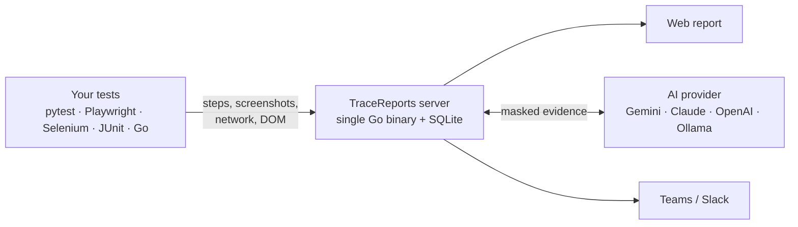

<a href="https://github.com/josemiguellopez/tracereports"></a>

<p align="center">
  <a href="https://github.com/josemiguellopez/tracereports/stargazers"></a>
  <a href="./LICENSE"></a>
  
  
</p>

<p align="center">
  <b>pytest</b> · <b>Playwright</b> · <b>Selenium</b> · <b>JUnit 5</b> · <b>Go</b> · any language over REST
  <br />
  🌐 <b>English</b> · <a href="README.es.md">Español</a>
</p>

# TraceReports

**The test report that tells you *why* a test failed, not just *that* it failed.**

TraceReports is a self-hosted test report server. Every step with its screenshot, every HTTP call
the browser made, and an AI diagnosis that turns a wall of red into a handful of incidents.

```bash
docker compose up -d                       # server + UI on http://localhost:8080
pip install pytest pytest-playwright ./client/python
pytest --tracereports                      # that's it, no code changes
```

<p align="center">
  
  <br />
  <sub>A real run of the <a href="examples/orangehrm">OrangeHRM example suite</a> with simulated backend failures, in the Pixel theme.</sub>
</p>

## The problem

It's 9 a.m. and the nightly run has 15 red tests. A typical report gives you 15 stack traces that
say `TimeoutError` or `element not found`. Now you open the backend logs, rerun locally and ask on
Slack whether someone deployed something.

TraceReports collects the evidence while the test runs, so the report already knows:

> **15 tests failed right after `POST /auth/login` returned 500.**
> Likely cause: the auth service ran out of database connections. Check that first.

It shows the screenshot, the failed call with its body and the timeline that ties them together.
The AI cause is always shown as a hypothesis, next to the evidence it relies on.

## What's inside

<table>
  <tr>
    <td width="50%" valign="top">
      <h3>🧠 Run diagnosis</h3>
      Groups failures that share evidence (the same failed backend call, the same error signature)
      into incidents, with the likely cause and what to check first.
      <br /><br />
      
    </td>
    <td width="50%" valign="top">
      <h3>⏱️ Timeline</h3>
      Steps, screenshots and network calls on one timeline. See exactly what the test was waiting
      for when the backend answered 500.
      <br /><br />
      
    </td>
  </tr>
  <tr>
    <td width="50%" valign="top">
      <h3>🌐 The network the browser saw</h3>
      Status, timings, headers and bodies, with <i>Copy as cURL</i> and a Playwright, Cypress or
      WireMock stub generated from the failed call. Passwords and cookies arrive already masked.
      <br /><br />
      
    </td>
    <td width="50%" valign="top">
      <h3>🎯 Broken locators</h3>
      When a selector stops matching, it reads the DOM at the moment of failure and suggests
      robust replacements, ready to copy and highlighted on the screenshot.
      <br /><br />
      
    </td>
  </tr>
  <tr>
    <td width="50%" valign="top">
      <h3>📣 Escalate in one click</h3>
      A summary for Business, QA or Development with the screenshot, the failed calls and the
      diagnosis. Copy it as text, Markdown, email or image, or send it to Teams or Slack.
      <br /><br />
      
    </td>
    <td width="50%" valign="top">
      <h3>▶️ Replay</h3>
      Plays the test back step by step with its screenshots, like a video. Play, pause, 1x/2x and
      keyboard shortcuts.
      <br /><br />
      
    </td>
  </tr>
</table>

And also:

- **Flaky vs. broken.** History per test that tells a flaky test from a persistent failure.
- **Latency regressions.** Flags tests whose network got slower (p95) than in previous runs.
- **Run comparison.** New failures, fixed tests and slower tests compared with the previous run.
- **Live.** Steps show up while the tests are still running.
- **Metrics.** Pass rate, the tests that waste the most time, flaky tests and failure causes over time.
- **Share offline.** Export a run as a ZIP that opens without a server or internet.

The [full feature tour](README.en.md) covers every option.

## Pick your look

Six themes, switchable from the UI: Trace, Trace Dark, Midnight, Paper, Terminal and, of course,
Pixel.

<p align="center">
  
</p>

## How it works



Clients send evidence in the background, so a slow or offline server never breaks your tests.
The server masks secrets before storing anything, and the AI and webhooks are optional.

## Quick start

**1. Start the server.**

```bash
docker compose up -d     # or: go run ./cmd   (Go 1.26+)
```

**2. Report your tests** with one of the clients:

| Client | What it does |
| --- | --- |
| [`client/python`](client/python) | pytest plugin: `pytest --tracereports`. Background delivery with retries, pytest-xdist support. |
| [`client/js`](client/js) | Playwright Test reporter and fixtures, plus Selenium WebDriver helpers. JavaScript and TypeScript. |
| [`client/java`](client/java) | JUnit 5 extension for Selenium and Playwright for Java. |
| [`client/go`](client/go) | Go client, with a playwright-go example. |
| [REST API](docs/en/api.md) | Any other language or framework. |

**3. (Optional) Turn on AI.** Set `GEMINI_API_KEY` (free tier) or pick Claude, OpenAI, any
compatible API or a local Ollama under **Settings**, no restart needed.

**4. (Recommended if the server is shared) Protect it** with `TRACEREPORTS_TOKEN`. See
[configuration](docs/en/configuration.md#security).

Runnable examples for every client live in [`examples/`](examples), all against the public
OrangeHRM demo.

## Documentation

- [Full feature tour](README.en.md)
- [Installation](docs/en/installation.md) · [Docker](docs/en/docker.md) · [Configuration](docs/en/configuration.md)
- [Python](docs/en/python.md) · [JavaScript](docs/en/javascript.md) · [Java](docs/en/java.md) · [Go](docs/en/go.md) · [REST API](docs/en/api.md)
- [Continuous integration](docs/en/ci.md) · [UI tokens and themes](docs/en/ui-tokens.md)

## Privacy

TraceReports runs on your own machine or server and sends no telemetry. Tokens, passwords, cookies
and credentials are masked before anything is stored, whichever client sent them. Evidence only
leaves your server if you turn on a cloud AI provider (use Ollama to keep it in-house) or a
Teams/Slack webhook. Screenshots are stored as taken, so avoid showing secrets on screen.

## Status

> [!NOTE]
> TraceReports is pre-1.0. Clients, API and configuration can still change between minor releases.

## Support the project

If TraceReports saved you a morning of digging through logs, **give it a ⭐**. It's the easiest way
to help other QA engineers find it.

And if you want to buy me a coffee while I keep building it:

<a href="https://paypal.me/lopezjosemiguel"></a>

## License

[Apache-2.0](LICENSE). The pixel art Go gopher in the banner is adapted from the original Go gopher by
Renée French, licensed under [CC BY 4.0](https://creativecommons.org/licenses/by/4.0/).

<p align="center">
  <a href="https://star-history.com/#josemiguellopez/tracereports&Date">
    
  </a>
</p>
